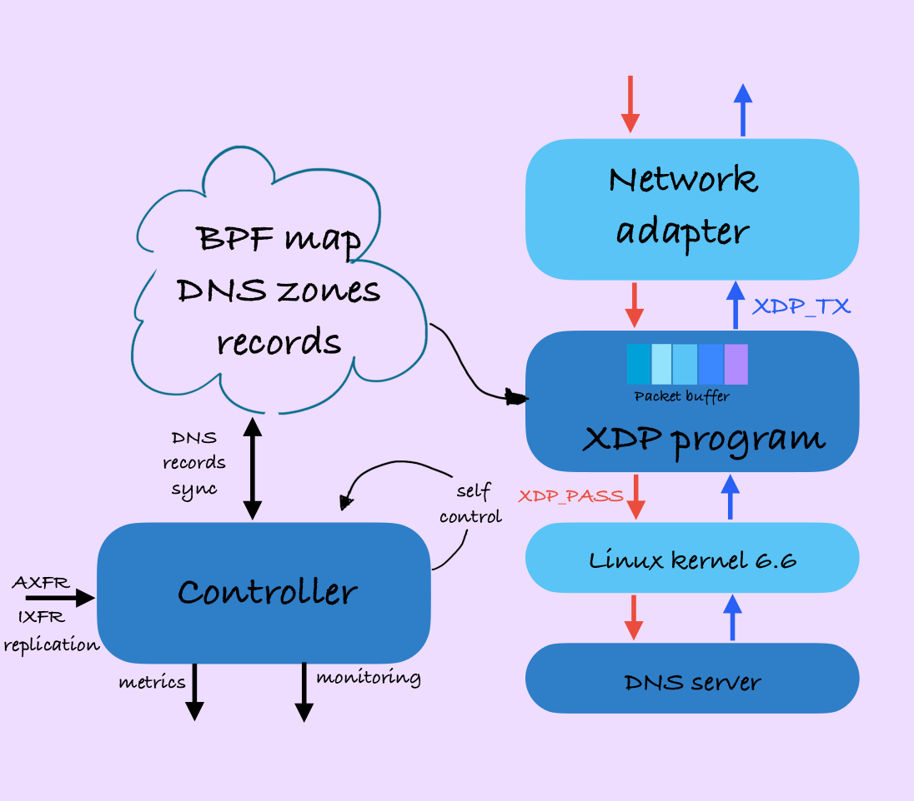
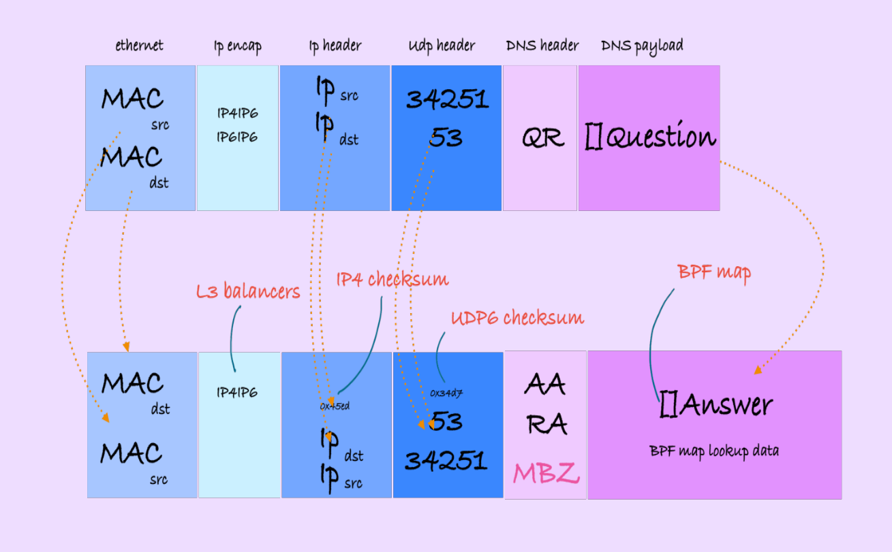
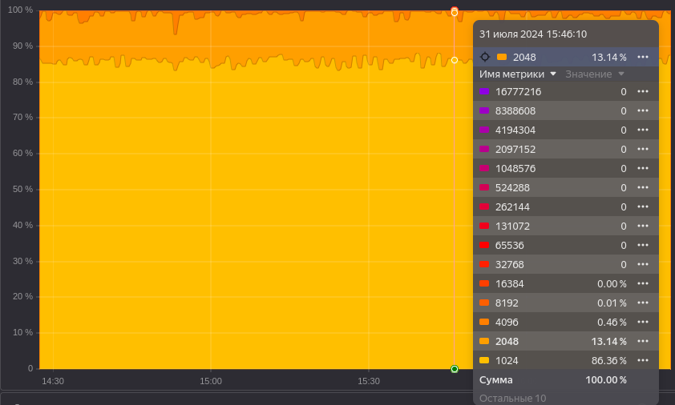
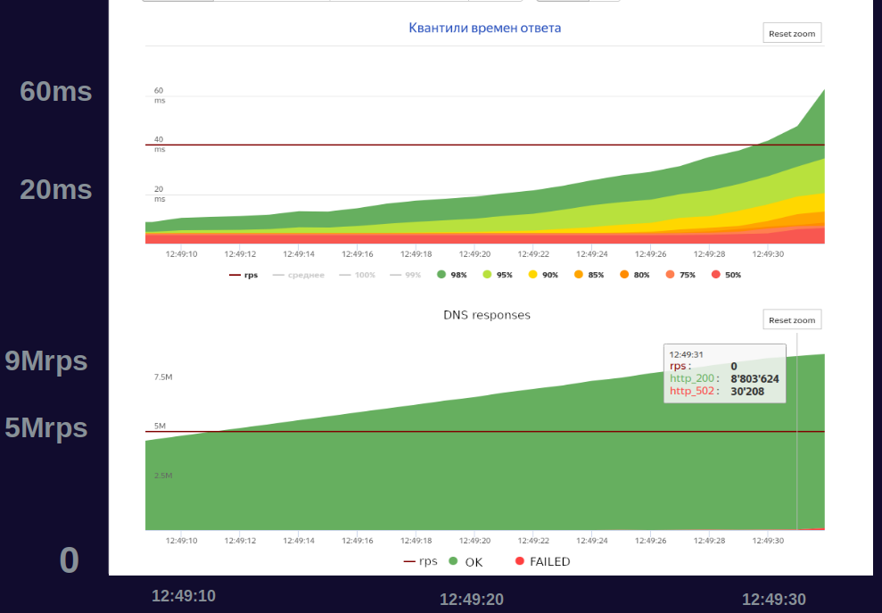

# YADNS controller (y2) DNS XDP offload
YADNS (y2) controller implements control plane and a list of plugin modules to offload DNS processing into XDP. EBPF XDP programming is used to process incoming DNS packets and to form corresponding responses. DNS responses are prepared by control plane and synced with EBFP maps. Controller transfers DNS zones from external sources and syncronizes recevied data with EBPF XDP program maps.

<p align="center" width="100%">
   <br>
   <b>Figure 1. YADNS (y2) controller</b><br>
</p>

## Details
XDP program proceses incoming packets in buffer to filter DNS request packets and to detect requests with known responses.

It sequentially parses and checks:
* Ethernet header
* IPIP header (detecting all cases: ``IP6IP6``, ``IP6IP4``, ``IP4IP4``)
* IP header (waiting dst IP match)
* UDP header (skipping TCP)
* **DNS** header (checking DNS header attributes, e.g. DNS request flag)
* **DNS** payload (parsing DNS **QNAME**)

<p align="center" width="100%">
   <br>
   <b>Figure 2. XDP DNS packet processing</b><br>
</p>

A response DNS packet is formed as follows:
* **DNS** response payload is taken from DNS RR set EBPF map
* **DNS** header includes flags ``[AA, RA, MBZ]``
* swap addresses and port in headers UDP, IP, Ethernet
* buffer changes (IPIP encapsulation and DNS payload room via ``bpf_xdp_adjust_`` helpers)
* calculate UDP6, IP4 checksums
* returning with ``XDP_TX``

## Features and capabilites
- XDP DNS request packet processing
- XDP DNS **A/AAAA** response
- IPIP encapsulation packet processing
- Authoritative and recursive responses
- Random TTL in responses (used for recursive responses)
- AXFR/IXFR DNS zones transfers
- DNS notify processing
- TSIG zone transfers 
- Metrics, monitoring and self control

## Features in backlog
- DNS responses for a list of DNS types
- Multiple round-robin DNS responses
- Adaptive cache algorihtm
- EBPF map per CPU

## Limitations
- Only UDP DNS packets
- Only positive **A/AAAA** DNS responses
- Limits for FQDN DNS requests length (as BPF program complexity grows)


## Build
Prerequites for building
* recent versions of unbuntu: **focal 20.04**, **jammy 22.04**
* linux kernel **>= 5.15** 
* golang [[1](https://go.dev/dl/)], versions **>= 1.20** 
* clang and llvm
* libbpf, linked as submodule (used for bpf programs)

```sh
# installing clang and llvm
sudo apt-get install clang llvm

# cloning yadns controller (y2) repo with
# submodules (libbpf)
git clone --recurse-submodules https://github.com/yandex/yadns-controller

# making y2 and bpf programs
cd yadns-controller && make -f Makefile
```

## Quick start
Running example configuration y2.yaml. This example of DNS zone provided as a file. Controller periodically fetches zone file ``example.com`` and syncronizes its content with EBPF DNS RR maps. XDP program is attached to **lo** interface. Controller runs under ``root`` and does not detach from console for debugging purposes.
```sh
# running example y2.yaml configuration with make run or
# sudo y2 -C y2.yaml server -B yadns-xdp.bpf.o server start --debug
make run

#DEBU[2024-07-31 14:45:55.814188] [3376865]:[118] (xdp) (run) bpf:'yadns-controller/yadns-xdp.bpf.o' attached to interface:'lo' OK
#DEBU[2024-07-31 14:45:55.814261] [3376865]:[118] (xdp) (run) bpf:'yadns-controller/yadns-xdp.bpf.o' on:'lo' waiting...
```

Running DNS resolve commands in another console we ensure that XDP program is responding to our requests - it adds specific flag ``MBZ`` to distinguish such responses.
```sh
# resolving example.com as we have such zone
# configured in y2
dig @::1 example.com -t A

; <<>> DiG 9.18.28-0ubuntu0.22.04.1-Ubuntu <<>> @::1 example.com -t A
; (1 server found)
;; global options: +cmd
;; Got answer:
;; ->>HEADER<<- opcode: QUERY, status: NOERROR, id: 37282
;; flags: qr rd ra; MBZ: 0x4; QUERY: 1, ANSWER: 1, AUTHORITY: 0, ADDITIONAL: 0

;; QUESTION SECTION:
;example.com.			IN	A

;; ANSWER SECTION:
example.com.		10282	IN	A	127.0.0.77

;; Query time: 0 msec
;; SERVER: ::1#53(::1) (UDP)
;; WHEN: Wed Jul 31 14:51:17 MSK 2024
;; MSG SIZE  rcvd: 45
```

## Experiments and numbers 
Direct comparison between traditional **unbound** DNS server and DNS XDP offload via **y2** controller shows the following results

|   | dns server |  platform      | adapter | max, RPS     | min, mcs | avg, mcs | max, mcs |   
|---| ---------- | ---------------| --------| ---------------|----------|----------|----------|
| 1 | unbound    |  2660v4 56 CPU |  mlx5   | ~500Krps     |    155   |  414     | 4821     |
| 2 | DNS XDP    |  2660v4 56 CPU |  mlx5   | **~8.8Mrps** |      1   |  2       | 12       |

<p align="center" width="100%">
   <br>
   <b>Figure 3. DNS XDP offload times, ns</b><br>
</p>

However, in the real production cases useful approach is to have both unbound and y2 DNS offload work together: DNS requests that could be offloaded are processed in higher rates by XDP program, others - bypassed to dns server via traditional kernel packet processing. 

<p align="center" width="100%">
   <br>
   <b>Figure 4. DNS XDP offload benchmarking requests, rps</b><br>
</p>

## License
[Apache License, Version 2.0](LICENSE)

## Contributing
See the [CONTRIBUTING](CONTRIBUTING.md) file for details.
